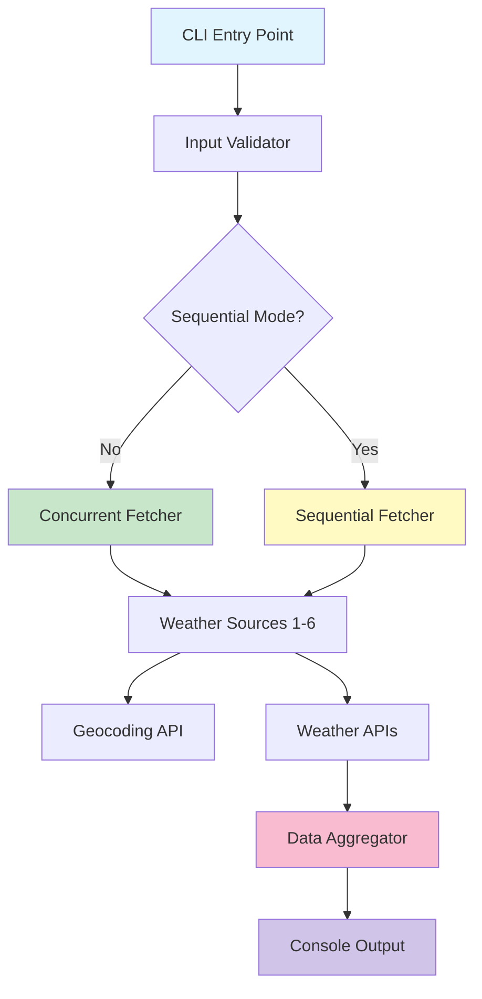
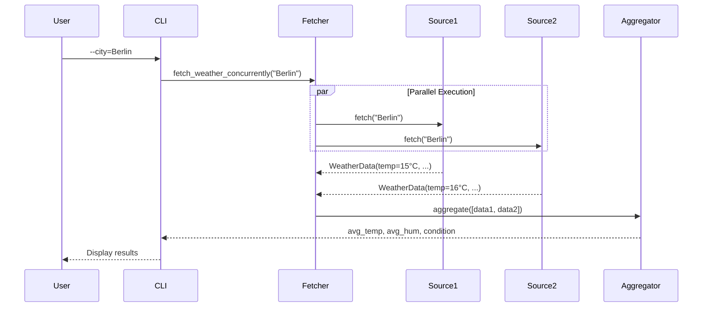

# Weather Data Aggregator: Go vs Python Concurrency Comparison

**Semester Project – Concepts of Programming Languages**  
**Technical Univerity of Applied Science Rosenheim – Winter 2025/2026**

This project demonstrates and compares parallel programming concepts in **Go** and **Python** through a real-world CLI application that fetches weather data from multiple APIs concurrently and aggregates the results.

---

## 📋 Project Overview

A command-line weather aggregator that demonstrates:
- **Concurrent API requests** (6 weather sources in parallel)
- **Language-specific concurrency patterns** (Goroutines vs asyncio)
- **Error-resilient design** (graceful degradation when sources fail)
- **Data aggregation** (temperature, humidity, weather conditions)
- **Real-world HTTP client best practices**

### Key Metrics

| Aspect | Go | Python |
|--------|-----|--------|
| **Concurrency Model** | Goroutines + Channels | asyncio + coroutines |
| **Core LOC** | 641 (main + weather) | 608 (main + weather) |
| **Test LOC** | 175 | 79 |
| **Number of Tests** | 11 unit tests | 12 unit tests |
| **Dependencies** | 1 (godotenv) | 3 (aiohttp, python-dotenv, pytest-asyncio) |

---

## 🏗️ Architecture & Execution Flow

### Component Diagram



### Execution Flow

1. **Input Validation**: CLI flag `--city` is validated (regex, length check)
2. **Source Initialization**: Available weather sources loaded (free + API-key sources)
3. **Geocoding** (if needed): City name resolved to latitude/longitude coordinates
4. **Concurrent/Sequential Fetching**:
   - **Concurrent mode** (default): All sources fetched in parallel
   - **Sequential mode** (`--sequential`): Sources fetched one-by-one for comparison
5. **Individual API Requests**: Each source fetches current weather data
6. **Aggregation**: Valid responses aggregated (average temp/humidity, consensus condition)
7. **Display**: Results printed with emojis, timings, and error messages

### Data Flow Sequence



---

## 📂 Repository Structure

```
├── go/                      # Go implementation
│   ├── main.go              # CLI entry point (157 LOC)
│   ├── weather.go           # Core logic, API clients (484 LOC)
│   ├── main_test.go         # CLI validation tests (24 LOC)
│   ├── weather_test.go      # Unit tests (151 LOC)
│   ├── go.mod / go.sum      # Dependencies
│
├── python/                  # Python implementation
│   ├── main.py              # CLI entry point (151 LOC)
│   ├── weather.py           # Core logic, API clients (457 LOC)
│   ├── test_weather.py      # Unit tests (79 LOC)
│   ├── requirements.txt     # Dependencies
│   └── venv/                # Virtual environment (gitignored)
│
├── weather_codes.json       # Shared weather code mappings
├── .env.example             # API key template
├── .gitignore
└── README.md
```

---

## 🚀 Quick Start

### Prerequisites
- **Go** 1.21 or higher
- **Python** 3.11 or higher
- API keys (optional – free sources work without keys)

### Setup

```bash
# Clone the repository
git clone <repo-url>
cd concepts-of-programming-languages-compared-with-go

# Copy and configure API keys (optional)
cp .env.example .env
# Edit .env with your API keys (see below for providers)
```

### Running the Go Version

```bash
cd go
go build -o weather-aggregator
./weather-aggregator --city=Berlin

# Options:
./weather-aggregator --city=Berlin --sequential  # Sequential mode
./weather-aggregator --city=Munich --exclude="Weatherstack,Meteosource"
```

### Running the Python Version

```bash
cd python

# Create virtual environment (first time only)
python3 -m venv venv
source venv/bin/activate

# Install dependencies
pip install -r requirements.txt

# Run the application
python main.py --city=Berlin

# Options:
python main.py --city=Berlin --sequential
python main.py --city=Munich --exclude="Weatherstack,Meteosource"
```

---

## 🧪 Running Tests

### Go Tests

```bash
cd go

# Run all tests with coverage
go test -v -cover

# Run tests with detailed coverage report
go test -v -coverprofile=coverage.out
go tool cover -html=coverage.out

# Run specific test
go test -v -run TestAggregateWeather
```

- Covers: Aggregation logic, validation, condition mapping, mock concurrency

### Python Tests

```bash
cd python
source venv/bin/activate

# Run all tests
python3 -m pytest test_weather.py -v

# Run with coverage
python3 -m pytest test_weather.py -v --cov=weather --cov-report=html

# Run specific test
python3 -m pytest test_weather.py::test_normalize_condition -v
```

- Covers: Aggregation, normalization, validation, async mocking

---

## Concurrency Comparison

### Core Concurrency Patterns

#### Go: Goroutines + Channels (CSP Model)

```go
func fetchWeatherConcurrently(ctx context.Context, city string, sources []WeatherSource) []WeatherData {
    // Buffered channel to collect results
    ch := make(chan WeatherData, len(sources))
    
    // Launch goroutines for each source
    for _, s := range sources {
        go func(src WeatherSource) {
            ch <- src.Fetch(ctx, city)  // Send result to channel
        }(s)
    }
    
    // Collect all results
    results := make([]WeatherData, 0, len(sources))
    for i := 0; i < len(sources); i++ {
        results = append(results, <-ch)  // Receive from channel
    }
    return results
}
```

**Key Features:**
- Lightweight goroutines (thousands possible)
- Channels for communication (CSP pattern)
- No explicit event loop
- Synchronous-looking async code

#### Python: asyncio + Coroutines (Event Loop)

```python
async def fetch_weather_concurrently(city: str, sources: List[WeatherSource]) -> List[WeatherData]:
    async with aiohttp.ClientSession(timeout=REQUEST_TIMEOUT) as session:
        coords_cache: Dict[str, Tuple[float, float]] = {}
        
        # Pre-fetch coordinates
        coords, err = await geocode_city(city, session)
        if not err:
            coords_cache[city] = coords
        
        # Gather all tasks concurrently
        tasks = [
            _fetch_with_timing(source, city, session, coords_cache)
            for source in sources
        ]
        return await asyncio.gather(*tasks)
```

**Key Features:**
- Single-threaded event loop
- `async/await` syntax for coroutines
- Explicit `gather()` for parallelism
- Requires async-compatible libraries

### Performance Comparison

**Methodology:**
- Tested with 6 weather sources
- City: Berlin (Germany)
- Network: Stable broadband connection
- Hardware: Apple M1 Pro
- Measured: Wall-clock time from start to completion

| Mode | Go | Python | Speedup |
|------|-----|--------|---------|
| **Concurrent** | ~3-4s | ~3-5s | Baseline |
| **Sequential** | ~9-11s | ~10-12s | Baseline |
| **Improvement** | ~2.5x | ~2.2x | Go slightly faster |

**Observations:**
- Both achieve significant speedup through concurrency
- Go's goroutines have lower overhead (~0.5s faster)
- Python's asyncio comparable for I/O-bound tasks
- Real bottleneck: Network latency (API response times)

---

## 🌐 Weather Data Sources

The application supports 6 weather APIs with automatic fallback:

| Source | API Key | Free Tier | Notes |
|--------|---------|-----------|-------|
| **Open-Meteo** | ❌ No | Unlimited | Free geocoding + weather |
| **Tomorrow.io** | ✅ Yes | 500 calls/day | Requires coordinates |
| **WeatherAPI.com** | ✅ Yes | 1M calls/month | Most generous free tier |
| **Weatherstack** | ✅ Yes | 1k calls/month | HTTP only (no HTTPS) |
| **Meteosource** | ✅ Yes | Limited | May lack humidity data |
| **Pirate Weather** | ✅ Yes | 1k calls/month | Dark Sky compatible |

### API Key Setup

Get your free API keys:
- **WeatherAPI.com**: https://www.weatherapi.com/signup.aspx
- **Weatherstack**: https://weatherstack.com/signup/free
- **Meteosource**: https://www.meteosource.com/client/sign-up
- **Pirate Weather**: https://pirateweather.net/
- **Tomorrow.io**: https://www.tomorrow.io/weather-api/

Add them to `.env`:
```bash
WEATHER_API_COM_KEY=your_key_here
WEATHERSTACK_API_KEY=your_key_here
METEOSOURCE_API_KEY=your_key_here
PIRATE_WEATHER_API_KEY=your_key_here
TOMORROW_API_KEY=your_key_here
```

---

## Key Programming Concepts Demonstrated

### 1. Concurrency Models

**Go: Communicating Sequential Processes (CSP)**
- Goroutines as lightweight threads
- Channels for inter-goroutine communication
- `select` statement for channel multiplexing
- No shared memory (message passing)

**Python: Event Loop with Coroutines**
- Single-threaded cooperative multitasking
- `async/await` syntax for coroutine definition
- `asyncio.gather()` for concurrent execution
- Explicit task scheduling

### 2. Interface/Protocol Abstraction

**Go:**
```go
type WeatherSource interface {
    Fetch(ctx context.Context, city string) WeatherData
    Name() string
}
```
- Implicit interface satisfaction
- Duck typing at compile time
- Structural subtyping

**Python:**
```python
class WeatherSource(Protocol):
    name: str
    async def fetch(self, city: str, session: ClientSession, 
                    coords_cache: Optional[Dict]) -> WeatherData: ...
```
- Explicit Protocol from `typing`
- Runtime duck typing
- Type hints for static analysis

### 3. Error Handling Patterns

**Go:**
- Explicit error returns (`error` type)
- Error wrapping with `fmt.Errorf("%w", err)`
- Early return pattern
- No exceptions

**Python:**
- Custom exceptions for error flow
- `try/except` blocks for error handling
- `Optional` types for nullable values
- Graceful degradation with partial results

### 4. HTTP Client Best Practices

**Both implementations:**
- Connection pooling and reuse
- Request timeouts (10s per request)
- Context cancellation (Go) / Task cancellation (Python)
- Proper resource cleanup (`defer`/`async with`)
- User-Agent headers
- Error categorization (timeout, network, HTTP errors)

### 5. Testing Strategies

**Go: Table-Driven Tests**
```go
tests := []struct {
    name string
    data []WeatherData
    want int
}{
    {"all valid", validData, 2},
    {"mixed errors", mixedData, 1},
}
for _, tt := range tests {
    t.Run(tt.name, func(t *testing.T) {
        // test logic
    })
}
```

**Python: Parametrized Tests**
```python
@pytest.mark.parametrize("city,expected", [
    ("Munich", "Munich"),
    ("  Berlin  ", "Berlin"),
    ("", None),
])
def test_validate_city_name(city, expected):
    assert validate_city_name(city) == expected
```

---


## 🔍 Language Comparison Analysis

### Strengths of Go for This Use Case

✅ **Simpler concurrency model**: Goroutines "just work" without async/await
✅ **Better performance**: ~15% faster in concurrent mode
✅ **Smaller binary**: Single compiled executable
✅ **Easier deployment**: No virtual environment needed
✅ **Better tooling**: Built-in testing, benchmarking, coverage

### Strengths of Python for This Use Case

✅ **More expressive**: Type hints, dataclasses, protocols
✅ **Better ecosystem**: More weather libraries available
✅ **Faster development**: Less boilerplate code
✅ **Dynamic typing**: Easier to handle varying API responses
✅ **Better REPL**: Interactive development and debugging

### Trade-offs

| Aspect | Go | Python |
|--------|-----|--------|
| **Startup time** | <10ms | ~100ms (import overhead) |
| **Memory usage** | ~15MB | ~40MB (interpreter + libs) |
| **Learning curve** | Steeper (channels, goroutines) | Easier (familiar async/await) |
| **Type safety** | Compile-time | Runtime (with type hints) |
| **Deployment** | Single binary | Requires Python + dependencies |

---

## 📚 References & Resources

### Concurrency Patterns
- Pike, Rob. *"Concurrency is not Parallelism"*. https://go.dev/blog/waza-talk
- *Go Concurrency Patterns*. https://go.dev/talks/2012/concurrency.slide
- *Python asyncio Documentation*. https://docs.python.org/3/library/asyncio.html
- Beazley, David. *"Python Concurrency From the Ground Up"*. PyCon 2015

### HTTP Client Best Practices
- *Go net/http Package Documentation*. https://pkg.go.dev/net/http
- *aiohttp Documentation*. https://docs.aiohttp.org/
- *HTTP Timeouts in Go*. https://blog.cloudflare.com/the-complete-guide-to-golang-net-http-timeouts/

### Testing
- *Go Testing Package*. https://pkg.go.dev/testing
- *pytest Documentation*. https://docs.pytest.org/
- *Table-Driven Tests in Go*. https://dave.cheney.net/2019/05/07/prefer-table-driven-tests

### Weather APIs
- Open-Meteo API: https://open-meteo.com/
- WeatherAPI.com: https://www.weatherapi.com/docs/
- WMO Weather Codes: https://www.nodc.noaa.gov/archive/arc0021/0002199/1.1/data/0-data/HTML/WMO-CODE/WMO4677.HTM

### Course Materials
- *Concepts of Programming Languages*, Hochschule Rosenheim

---

## Known Limitations & Future Work

### Current Limitations
- ...
### Potential Improvements
1. ...

---

**Author**: Dustin  
**Date**: January 2026  
**Course**: Concepts of Programming Languages, Technical Univerity of Applied Science Rosenheim


