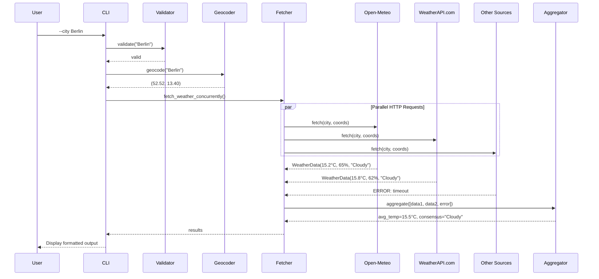

# Weather Data Aggregator: Comparing Go Parallel Programming with Python

**Semester Project – Concepts of Programming Languages**  
**Technical University of Applied Science Rosenheim – Winter 2025/2026**

## Overview

This project compares Go's parallel programming capabilities with Python's concurrency approaches by implementing the same CLI application in both languages. The program fetches weather data from multiple APIs concurrently, aggregates the results, and demonstrates how Go's goroutines (with true parallelism) compare to Python's asyncio (concurrency) for I/O-bound operations.

**What it does:**
- Takes a city name as input
- Queries 5 weather APIs concurrently (or sequentially for comparison)
- Aggregates temperature, humidity, and weather condition data
- Handles API failures gracefully (shows partial results if some sources fail)

**Why these languages:**
- **Go**: Statically typed, compiled. Uses goroutines and channels (CSP model) with true parallelism capability
- **Python**: Dynamically typed, interpreted. Uses asyncio event loop with async/await (concurrency)

The goal was to compare Go's parallel programming model with Python's concurrency approach for the same real-world problem: making multiple HTTP requests efficiently while dealing with timeouts, errors, and varying response times. This reveals a key insight—Go enables true parallelism through goroutines on multiple CPU cores, while Python's asyncio provides concurrency on a single thread, both effective for I/O-bound tasks but fundamentally different in architecture.

## Quick Start

Run from the repository root. First-time setup:

```bash
# create venv once
python3 -m venv python/venv
source python/venv/bin/activate
pip install -r python/requirements.txt
```
If you want all 5 sources to work, create a `.env` with API keys before running.
Then use the helper script (with the venv activated for Python):

```bash
# Run Go version (default)
./weather-service --city Berlin

# Run Python version
./weather-service python --city München

# Run both versions side-by-side for comparison
./weather-service both --city "San Francisco"

```


## Setup

### Prerequisites
- Go 1.21+ ([download](https://go.dev/doc/install))
- Python 3.13+ ([download](https://www.python.org/downloads/))
- API keys (optional, see below)

### API Keys (Optional, required for 4 sources)

The program works out of the box with just Open-Meteo (free, no key needed). To enable all other sources, create a `.env` file in the repo root:

```bash
cp .env.example .env
```

Then add keys for:
- **WeatherAPI.com** (1M free calls/month): https://www.weatherapi.com/signup.aspx
- **Meteosource** (limited free): https://www.meteosource.com/client/sign-up
- **Pirate Weather** (1k free calls/month): https://pirateweather.net
- **Tomorrow.io** (500 free calls/day): https://www.tomorrow.io/weather-api

## Features

- **Concurrent API requests**: Fetches from 5 weather sources in parallel
- **Coordinate caching**: Geocodes city once, reuses coordinates for all APIs
- **Graceful degradation**: Returns partial results if some sources fail
- **Error handling**: Reports timeouts, network errors, HTTP errors, and parsing failures with descriptive messages
- **Weather code normalization**: Maps different API formats (WMO codes, Tomorrow.io codes) to unified conditions
- **Unicode support**: Works with international city names (München, São Paulo, etc.)
- **Performance comparison**: Sequential mode to measure concurrency speedup

## Program Structure and Execution Flow

### Architecture Overview

The application follows a modular architecture with clear separation of concerns:

**Component Diagram:**


### Execution Sequence

The following sequence diagram illustrates the concurrent execution flow:



### Data Flow and Component Interaction

1. **Input Validation** ([main.go](go/main.go#L13-L32) / [main.py](python/main.py#L25-L39))
   - Validates city name using Unicode-aware regex
   - Rejects empty strings, excessive length (>100 chars), or invalid characters
   - Joins multi-word city names from command-line arguments

2. **Source Initialization** ([weather.go](go/weather.go#L78-L94) / [weather.py](python/weather.py#L76-L93))
   - Loads weather code mappings from `weather_codes.json`
   - Initializes free sources (Open-Meteo)
   - Conditionally adds API-key sources if environment variables are present
   - Filters excluded sources based on CLI flags

3. **Geocoding** ([weather.go](go/weather.go#L121-L143) / [weather.py](python/weather.py#L127-L152))
   - Converts city name to latitude/longitude coordinates
   - Uses Open-Meteo Geocoding API (free, no key required)
   - Caches coordinates to avoid redundant API calls for sources needing coords

4. **Concurrent/Sequential Fetching**
   
   **Go Implementation Concurrent** ([weather.go](go/weather.go#L370-L388)):
   ```go
   // Buffered channel with capacity = number of sources
   ch := make(chan WeatherData, len(sources))
   
   // Launch goroutine for each source
   for _, src := range sources {
       go func(s WeatherSource) {
           ch <- s.Fetch(ctx, city, coordsCache)
       }(src)
   }
   
   // Collect all results
   for i := 0; i < len(sources); i++ {
       results = append(results, <-ch)
   }
   ```
   
   **Python Implementation Concurrent** ([weather.py](python/weather.py#L397-L413)):
   ```python
   # Create async tasks for all sources
   tasks = [
       _fetch_with_timing(source, city, session, coords_cache)
       for source in sources
   ]
   
   # Execute concurrently and gather results
   results = await asyncio.gather(*tasks)
   ```

5. **Individual API Requests**
   - Each source implements a unified interface (`WeatherSource`)
   - HTTP client with 10-second timeout
   - Parses JSON responses into structured data
   - Maps provider-specific weather codes to normalized conditions
   - Records request duration for performance analysis

6. **Aggregation** ([weather.go](go/weather.go#L405-L446) / [weather.py](python/weather.py#L435-L471))
   - Filters out errors (responses with Error field set)
   - Calculates average temperature from valid responses
   - Calculates average humidity (excludes sources without humidity data)
   - Determines consensus condition using majority voting

7. **Display** ([main.go](go/main.go#L106-L135) / [main.py](python/main.py#L83-L107))
   - Prints per-source results with timing
   - Shows error messages for failed sources
   - Displays aggregated statistics
   - Includes weather emojis and formatting

---

### Example Output: Go vs. Python

Below is a real output comparison for the same city (New York) with 4 sources, using both implementations side by side:


### Concurrency Model Comparison

The implementations use fundamentally different concurrency approaches:

**Architectural Comparison:**

| Aspect | Go Implementation | Python Implementation |
|--------|-------------------|----------------------|
| **Concurrency Model** | CSP-inspired (goroutines + channels) | Event loop with coroutines (async/await) |
| **Parallelism** | True parallelism: M:N threading, goroutines can run on multiple OS threads simultaneously | Cooperative multitasking: single thread, event loop multiplexes between tasks |
| **Scheduling** | Preemptive: Go scheduler can pause goroutines at runtime | Cooperative: coroutine must explicitly `await` to yield control |
| **Communication** | Channels (typed, blocking send/receive) | Shared state with futures/promises |
| **Syntax** | `go func()` to launch, `<-chan` to receive | `async def` to define, `await` to yield |
| **CPU Utilization** | Can use multiple cores (for CPU-bound work) | Single core only (GIL prevents parallel CPU work) |
| **Best For** | CPU-bound tasks, high concurrency, low-latency services | I/O-bound tasks, network operations, simple async code |

**Why Concurrency, Not Full Parallelism:**

This project targets I/O-bound operations (HTTP requests), where the bottleneck is network latency, not CPU computation. Go's goroutines provide true parallelism capability but gain their advantage from concurrency—overlapping I/O wait times. Python's `asyncio` achieves the same through single-threaded cooperative multitasking. Using Python's `multiprocessing` would add overhead without performance benefit for network-bound tasks. Key insight: concurrency (overlapping execution) matters for I/O-bound work; parallelism (multi-core execution) benefits CPU-bound tasks.

## Running the Program

### Using the Helper Script (Recommended)

The `weather-service` script is provided to simplify running and demonstrating the project:

```bash
# Run Go implementation (default)
./weather-service --city Berlin

# Run Python implementation
./weather-service python --city München

# Run both side-by-side for comparison
./weather-service both --city "New York"
```

The script automatically builds the Go binary if needed. Activate your Python virtual environment first so the Python run uses installed dependencies; the script does not create a venv for you. It is tested from the repository root.

For a complete list of options, run:
```bash
./weather-service --help
```

### Direct Execution

**Go:**
```bash
cd go
go build -o weather-aggregator
./weather-aggregator --city Berlin
```

**Python:**
```bash
cd python
python3 -m venv venv
source venv/bin/activate
pip install -r requirements.txt
./main.py --city Berlin
```

### CLI Options

- `--city <name>`: City name (required). Multi-word names don't need quotes unless they contain apostrophes
- `--sequential`: Run requests one by one instead of concurrently
- `--exclude <sources>`: Skip specific sources (comma-separated)

**Examples:**
```bash
./weather-service --city Munich --sequential
./weather-service python --city London --exclude WeatherAPI.com,Meteosource
./weather-service both --city "O'Brien"  # Apostrophe needs quotes
```

## Tests

Both implementations have test suites covering validation, aggregation, and fetch weather behavior.

**Go (20 test functions):**
```bash
cd go
go test -v          # Run all tests
```

**Python (15 test functions):**
```bash
cd python
source venv/bin/activate
python -m pytest test_weather.py -v                    # Run all tests  
```

**Note on test coverage:** The test suite is deliberately focused on core logic rather than exhaustively covering every API source. This approach was chosen to keep the implementation as close as possible to the recommended project scope. The tests use mocks to verify concurrency behavior and include integration tests for the free API source to ensure real-world functionality.

## Implementation Challenges

Building this project involved several non-trivial problems:

### 1. API Rate Limits and Reliability
Many free weather APIs have very low limits or are unreliable. For example, some (like Meteosource) often timed out or returned too many errors, and others (like weatherstack) had to be replaced because their free tier was not enough for testing. To handle this, the program just shows partial results if some sources fail, instead of stopping completely. I also added a timeout (10 seconds per request) so one slow API can't block everything.

### 2. Coordinating Parallel Requests
Different APIs have different requirements - some take city names, others need lat/lon coordinates. Had to implement coordinate caching to avoid geocoding the city multiple times. Go's channels made this straightforward, while Python's asyncio required careful async context management.

### 3. Weather Code Normalization
Each API returns weather conditions differently (WMO numeric codes, Tomorrow.io strings, plain text). Created a shared JSON mapping file to normalize everything to consistent categories (Clear, Cloudy, Rainy, etc.). This was trickier than expected because some codes overlap or are ambiguous.

### 4. Unicode Input Validation
Supporting international city names (München, São Paulo) meant dealing with Unicode properly. Regular expressions needed `\p{L}` (Go) or `re.UNICODE` (Python). Also had to handle shell escaping for city names with apostrophes or quotes.

## Design Decisions

**Why implement in both languages?**  
To directly compare concurrency models on the same problem. Go uses goroutines + channels (CSP style), Python uses async EventLoop. Wanted to see which felt more natural for I/O-bound tasks.

**Why allow partial results?**  
Weather data from 3/5 sources is better than no data. Free APIs are unreliable - timeouts and rate limits are common. Showing what worked while reporting what failed gives users useful information even when things go wrong.

**Why coordinate caching?**  
Some APIs need lat/lon instead of city names. Geocoding 5 times for the same city is wasteful and slower. Cache coordinates after first lookup, share across all sources.

**Why JSON for weather codes?**  
Each API uses different formats (WMO codes 0-99, Tomorrow.io "1000"/"1001", plain strings). Needed a way to map everything to unified categories without hardcoding. JSON file makes it easy to update mappings without recompiling - central for both languages.

**Why is the code above the ~500 LOC guideline?**  
I intentionally added more APIs (five sources in both languages) to make the comparison meaningful. Each adapter, plus shared weather-code mapping and validation, adds boilerplate. **Acknowledgement:** the current combined size exceeds the ~1,000 LOC guideline. Five sources provide a realistic scenario for demonstrating concurrency patterns and error handling.

**Go vs Python trade-offs observed:**
- Go: Simpler concurrency (goroutines just work), faster, single binary. But more verbose, less flexible types.
- Python: More expressive, easier prototyping, better for experimentation. But needs virtual env, slower startup, requires async-aware libraries.


## Performance Results (measured 2026-01-04)

Single-run measurements from the repository root using `./weather-service`, with all five sources enabled via `.env` and an active Python virtual environment:

| Mode | Go (time) | Python (time) | Difference |
|------|-----------|---------------|------------|
| Concurrent (default) | 0.637s (`./weather-service go --city Berlin`) | 0.792s (`./weather-service python --city Berlin`) | Go 1.24× faster (~20%) |
| Sequential (`--sequential`) | 1.432s | 1.564s | Go 1.09× faster (~8%) |
| Speedup from concurrency | 2.25× | 1.98× | Go benefits more (~14% higher speedup) |

**Observations:**
- **No clear winner**: Performance varies by run and network conditions. Sometimes Go is faster (as shown above), sometimes Python edges ahead.
- Both implementations handle I/O-bound work efficiently: Go with goroutines, Python with asyncio.
- Concurrency provides significant speedup in both languages (1.98×–2.25×), demonstrating that the concurrency model matters more than raw language speed for network requests.
- Results are network-dependent; rerun the commands above to reproduce on your machine. Measurements taken on macOS (M1 Pro), stable broadband, `.env` with API keys present.

## Conclusion: Python or Go?

For this weather aggregation project, both work equally well (~2× concurrency speedup). Go's goroutines + channels are conceptually elegant and felt more natural for this pattern. Python's asyncio was easier for me to implement due to existing experience, though it required more careful thinking about async context management. For production at scale, Go wins on simplicity and performance; for learning and experimentation, Python's flexibility and lower barrier to entry are advantages.

## References

Key resources used:
- Course materials: Concepts of Programming Languages (https://github.com/s-macke/concepts-of-programming-languages/tree/master)
- Rob Pike: "Concurrency is not Parallelism" (https://go.dev/blog/waza-talk)
- Python asyncio docs (https://docs.python.org/3/library/asyncio.html)
- Go net/http docs (https://pkg.go.dev/net/http) 
- aiohttp docs (https://docs.aiohttp.org)
- Open-Meteo API (https://open-meteo.com)
- WMO Weather Codes (https://www.nodc.noaa.gov/archive/arc0021/0002199/1.1/data/0-data/HTML/WMO-CODE/WMO4677.HTM)

---

**Author**: Dustin Maurer   
**Course**: Concepts of Programming Languages, Technical University of Applied Science Rosenheim  
**Date**: January 2026


