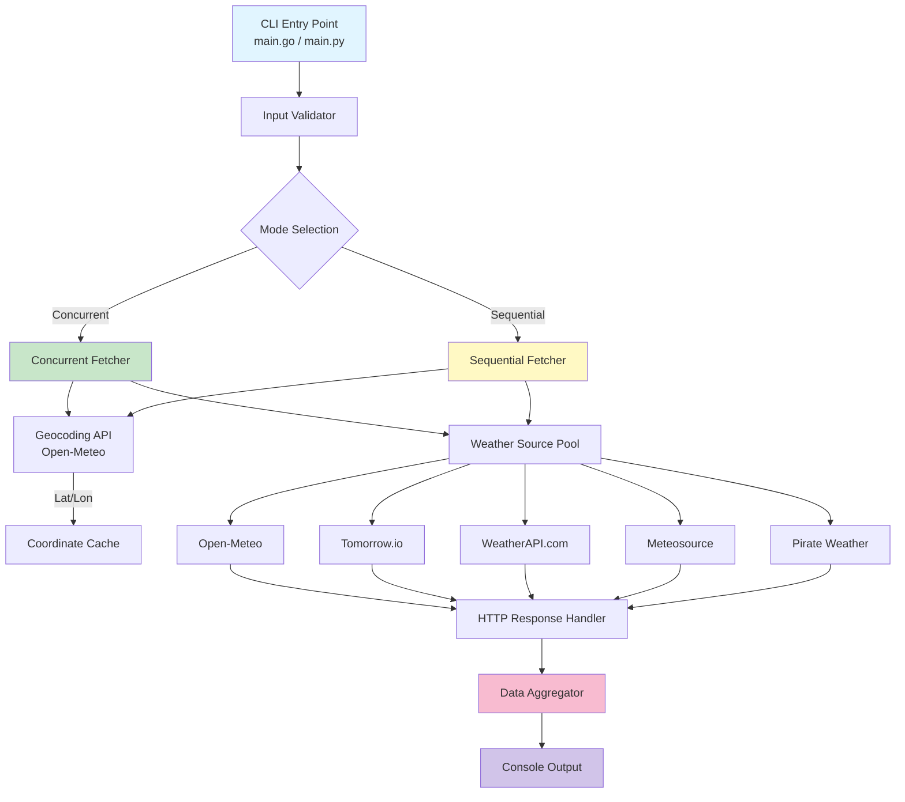
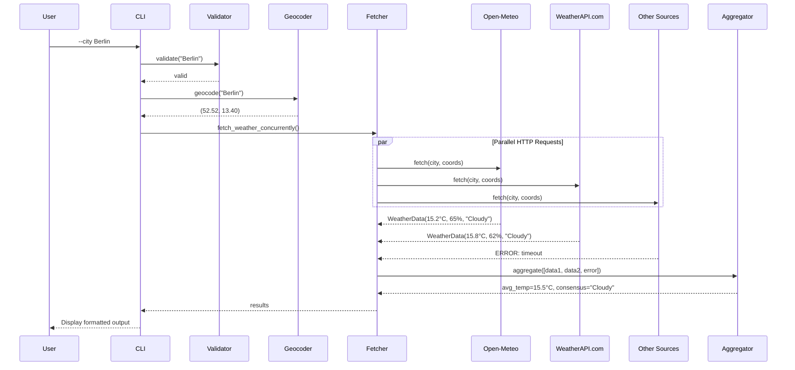
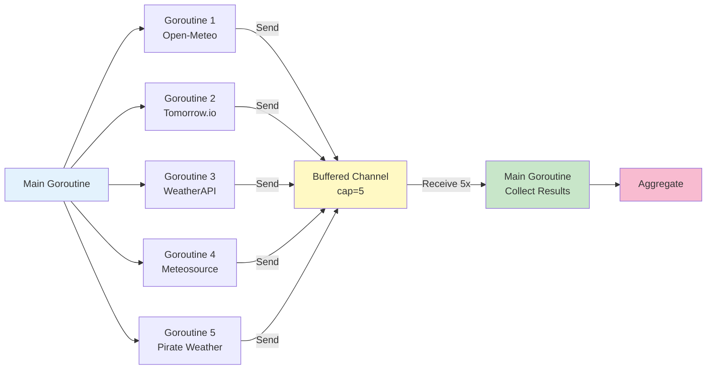
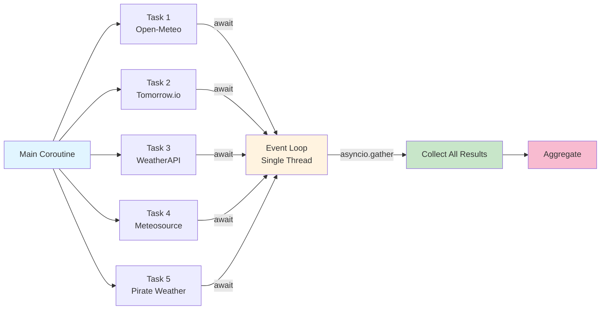

# Weather Data Aggregator: Comparing Go and Python Concurrency

**Semester Project – Concepts of Programming Languages**  
**Technical University of Applied Science Rosenheim – Winter 2025/2026**

## Overview

This project compares concurrent programming in Go and Python by implementing the same CLI application in both languages. The program fetches weather data from multiple APIs in parallel, aggregates the results, and demonstrates how different concurrency models handle I/O-bound operations.

**What it does:**
- Takes a city name as input
- Queries 5 weather APIs concurrently (or sequentially for comparison)
- Aggregates temperature, humidity, and weather condition data
- Handles API failures gracefully (shows partial results if some sources fail)

**Why these languages:**
- **Go**: Statically typed, compiled. Uses goroutines and channels (CSP model)
- **Python**: Dynamically typed, interpreted. Uses asyncio event loop with async/await

The goal was to see how each language handles the same real-world problem: making multiple HTTP requests efficiently while dealing with timeouts, errors, and varying response times.

## Quick Start

Run from the repository root using the included helper script:

```bash
# Run Go version (default)
./weather-service --city Berlin

# Run Python version
./weather-service python --city München

# Run both versions side-by-side for comparison
./weather-service both --city "San Francisco"

```

This script automatically builds the Go binary if needed. For Python, activate your virtual environment first (see Setup) so the script picks up the correct interpreter and installed dependencies. If you want all 5 sources to work, create a `.env` with API keys before running.


## Setup

### Prerequisites
- Go 1.21+ ([download](https://go.dev/doc/install))
- Python 3.11+ ([download](https://www.python.org/downloads/))
- API keys (optional, see below)

### API Keys (Optional, required for all 5 sources)

The program works out of the box with just Open-Meteo (free, no key needed). To enable all other sources, create a `.env` file in the repo root:

```bash
cp .env.example .env
```

Then add keys for:
- **WeatherAPI.com** (1M free calls/month): https://www.weatherapi.com/signup.aspx
- **Meteosource** (limited free): https://www.meteosource.com/client/sign-up
- **Pirate Weather** (1k free calls/month): https://pirateweather.net
- **Tomorrow.io** (500 free calls/day): https://www.tomorrow.io/weather-api

## Features

- **Concurrent API requests**: Fetches from 5 weather sources in parallel
- **Coordinate caching**: Geocodes city once, reuses coordinates for all APIs
- **Graceful degradation**: Returns partial results if some sources fail
- **Error handling**: Reports timeouts, network errors, HTTP errors, and parsing failures with descriptive messages
- **Weather code normalization**: Maps different API formats (WMO codes, Tomorrow.io codes) to unified conditions
- **Unicode support**: Works with international city names (München, São Paulo, etc.)
- **Performance comparison**: Sequential mode to measure concurrency speedup

## Program Structure and Execution Flow

### Architecture Overview

The application follows a modular architecture with clear separation of concerns:

**Component Diagram:**




### Execution Sequence

The following sequence diagram illustrates the concurrent execution flow:



### Data Flow and Component Interaction

1. **Input Validation** ([main.go](go/main.go#L13-L32) / [main.py](python/main.py#L23-L37))
   - Validates city name using Unicode-aware regex
   - Rejects empty strings, excessive length (>100 chars), or invalid characters
   - Joins multi-word city names from command-line arguments

2. **Source Initialization** ([weather.go](go/weather.go#L82-L96) / [weather.py](python/weather.py#L79-L96))
   - Loads weather code mappings from `weather_codes.json`
   - Initializes free sources (Open-Meteo)
   - Conditionally adds API-key sources if environment variables are present
   - Filters excluded sources based on CLI flags

3. **Geocoding** ([weather.go](go/weather.go#L123-L140) / [weather.py](python/weather.py#L123-L145))
   - Converts city name to latitude/longitude coordinates
   - Uses Open-Meteo Geocoding API (free, no key required)
   - Caches coordinates to avoid redundant API calls for sources needing coords

4. **Concurrent/Sequential Fetching**
   
   **Go Implementation** ([weather.go](go/weather.go)):
   ```go
   // Buffered channel with capacity = number of sources
   ch := make(chan WeatherData, len(sources))
   
   // Launch goroutine for each source
   for _, src := range sources {
       go func(s WeatherSource) {
           ch <- s.Fetch(ctx, city, coordsCache)
       }(src)
   }
   
   // Collect all results
   for i := 0; i < len(sources); i++ {
       results = append(results, <-ch)
   }
   ```
   
   **Python Implementation** ([weather.py](python/weather.py)):
   ```python
   # Create async tasks for all sources
   tasks = [
       _fetch_with_timing(source, city, session, coords_cache)
       for source in sources
   ]
   
   # Execute concurrently and gather results
   results = await asyncio.gather(*tasks)
   ```

5. **Individual API Requests**
   - Each source implements a unified interface (`WeatherSource`)
   - HTTP client with 10-second timeout
   - Parses JSON responses into structured data
   - Maps provider-specific weather codes to normalized conditions
   - Records request duration for performance analysis

6. **Aggregation** ([weather.go](go/weather.go) / [weather.py](python/weather.py))
   - Filters out errors (responses with Error field set)
   - Calculates average temperature from valid responses
   - Calculates average humidity (excludes sources without humidity data)
   - Determines consensus condition using majority voting

7. **Display** ([main.go](go/main.go) / [main.py](python/main.py))
   - Prints per-source results with timing
   - Shows error messages for failed sources
   - Displays aggregated statistics
   - Includes weather emojis and formatting

### Concurrency Model Comparison

The implementations use fundamentally different concurrency approaches:

**Go: Goroutines and Channels (CSP Model)**



**Python: asyncio Event Loop**



**Key Architectural Differences:**

| Aspect | Go Implementation | Python Implementation |
|--------|-------------------|----------------------|
| **Parallelism** | True parallelism (M:N threading, goroutines scheduled across OS threads) | Cooperative multitasking (single-threaded event loop) |
| **Communication** | Channels (CSP: Communicating Sequential Processes) | Futures/Promises (async/await pattern) |
| **Scheduling** | Preemptive (Go scheduler can interrupt goroutines) | Cooperative (coroutine must explicitly `await` to yield) |
| **Syntax** | Goroutines launched with `go func()`, channels with `make(chan)` | Coroutines defined with `async def`, awaited with `await` |
| **Synchronization** | Channel send/receive operations, `sync.WaitGroup` | `asyncio.gather()`, event loop manages tasks |

## Running the Program

### Using the Helper Script (Recommended)

The `weather-service` script is provided to simplify running and demonstrating the project:

```bash
# Run Go implementation (default)
./weather-service --city Berlin

# Run Python implementation
./weather-service python --city München

# Run both side-by-side for comparison
./weather-service both --city "New York"
```

The script automatically builds the Go binary if needed. Activate your Python virtual environment first so the Python run uses installed dependencies; the script does not create a venv for you. It is tested from the repository root.

For a complete list of options, run:
```bash
./weather-service --help
```

### Direct Execution

**Go:**
```bash
cd go
go build -o weather-aggregator
./weather-aggregator --city Berlin
```

**Python:**
```bash
cd python
python3 -m venv venv
source venv/bin/activate  # Windows: venv\Scripts\activate
pip install -r requirements.txt
./main.py --city Berlin
```

### CLI Options

- `--city <name>`: City name (required). Multi-word names don't need quotes unless they contain apostrophes
- `--sequential`: Run requests one by one instead of concurrently
- `--exclude <sources>`: Skip specific sources (comma-separated)

**Examples:**
```bash
./weather-service --city Munich --sequential
./weather-service python --city London --exclude WeatherAPI.com,Meteosource
./weather-service both --city "O'Brien"  # Apostrophe needs quotes
```

## Tests

Both implementations have test suites covering validation, aggregation, and weather code mapping.

**Go (4 test functions):**
```bash
cd go
go test -v          # Run all tests
go test -cover      # With coverage report
```

**Python (7 test functions):**
```bash
cd python
source venv/bin/activate
python -m pytest test_weather.py -v                    # Run all tests  
python -m pytest --cov=weather --cov-report=html      # With coverage
```

**Note on test coverage:** The test suite focuses on core logic (input validation, aggregation, condition mapping, and orchestration) rather than exhaustive coverage of all API sources. This decision was made to stay within the recommended project scope (~500 lines per language). The tests use mocks for testing concurrency behavior and include integration tests for the free API source to validate real-world functionality.

## Implementation Challenges

Building this project involved several non-trivial problems:

### 1. API Rate Limits and Reliability
Free-tier APIs have strict limits and varying reliability. Some sources (Meteosource) frequently timeout or return 429 errors. The solution was graceful degradation: show partial results instead of failing completely. Also had to add proper timeout handling (10s per request) to prevent one slow API from blocking everything.

### 2. Coordinating Parallel Requests
Different APIs have different requirements - some take city names, others need lat/lon coordinates. Had to implement coordinate caching to avoid geocoding the city multiple times. Go's channels made this straightforward, while Python's asyncio required careful async context management.

### 3. Weather Code Normalization
Each API returns weather conditions differently (WMO numeric codes, Tomorrow.io strings, plain text). Created a shared JSON mapping file to normalize everything to consistent categories (Clear, Cloudy, Rainy, etc.). This was trickier than expected because some codes overlap or are ambiguous.

### 4. Unicode Input Validation
Supporting international city names (München, São Paulo) meant dealing with Unicode properly. Regular expressions needed `\p{L}` (Go) or `re.UNICODE` (Python). Also had to handle shell escaping for city names with apostrophes or quotes.

### 5. Making Concurrency Actually Concurrent
Initial Python version didn't see speedup because I was accidentally calling sync functions in the async code. Had to use `aiohttp` instead of `requests` and ensure everything in the call chain was async-compatible. Go was simpler here - just prefix function calls with `go` and use channels.

## Design Decisions

**Why implement in both languages?**  
To directly compare concurrency models on the same problem. Go uses goroutines + channels (CSP style), Python uses async EventLoop. Wanted to see which felt more natural for I/O-bound tasks.

**Why allow partial results?**  
Weather data from 3/5 sources is better than no data. Free APIs are unreliable - timeouts and rate limits are common. Showing what worked while reporting what failed gives users useful information even when things go wrong.

**Why coordinate caching?**  
Some APIs need lat/lon instead of city names. Geocoding 5 times for the same city is wasteful and slower. Cache coordinates after first lookup, share across all sources.

**Why JSON for weather codes?**  
Each API uses different formats (WMO codes 0-99, Tomorrow.io "1000"/"1001", plain strings). Needed a way to map everything to unified categories without hardcoding. JSON file makes it easy to update mappings without recompiling.

**Why is the code above the ~500 LOC guideline?**  
I intentionally added more APIs (five sources in both languages) to make the comparison meaningful. Each adapter, plus shared weather-code mapping and validation, adds boilerplate. **Acknowledgement:** the current combined size (~1,760 LOC) exceeds the ~1,000 LOC guideline; a planned reduction to 3 sources (Open-Meteo + two key-based) would bring the project back within scope without losing the concurrency comparison value.

**Go vs Python trade-offs observed:**
- Go: Simpler concurrency (goroutines just work), faster, single binary. But more verbose, less flexible types.
- Python: More expressive, easier prototyping, better for experimentation. But needs virtual env, slower startup, requires async-aware libraries.


## Performance Results (measured 2026-01-04)

Single-run measurements from the repository root using `./weather-service`, with all five sources enabled via `.env` and an active Python virtual environment:

| Mode | Go (time) | Python (time) | Winner |
|------|-----------|---------------|---------|
| Concurrent (default) | 0.81s (`./weather-service go --city Berlin`) | 0.57s (`./weather-service python --city Berlin`) | Python ~1.4x faster |
| Sequential (`--sequential`) | 1.51s | 1.94s | Go ~1.3x faster |
| Speedup from concurrency | 1.87x | 3.44x | Python benefits more |

**Observations:**
- With all five sources active, Python's asyncio achieves the best concurrent time; Go remains faster in sequential mode.
- Concurrency provides larger gains in Python (3.44x) because the event loop hides I/O latency effectively.
- Results are network-dependent; rerun the commands above to reproduce on your machine. Measurements taken on macOS (M1 Pro), stable broadband, `.env` with API keys present.

## References

Key resources used:
- Rob Pike: "Concurrency is not Parallelism" (https://go.dev/blog/waza-talk)
- Python asyncio docs (https://docs.python.org/3/library/asyncio.html)
- Go net/http docs (https://pkg.go.dev/net/http) 
- aiohttp docs (https://docs.aiohttp.org)
- Open-Meteo API (https://open-meteo.com)
- WMO Weather Codes (https://www.nodc.noaa.gov/archive/arc0021/0002199/1.1/data/0-data/HTML/WMO-CODE/WMO4677.HTM)

---

**Author**: Dustin Maurer   
**Course**: Concepts of Programming Languages, Technical University of Applied Science Rosenheim  
**Semester**: Winter 2025/2026  
**Date**: January 2026


